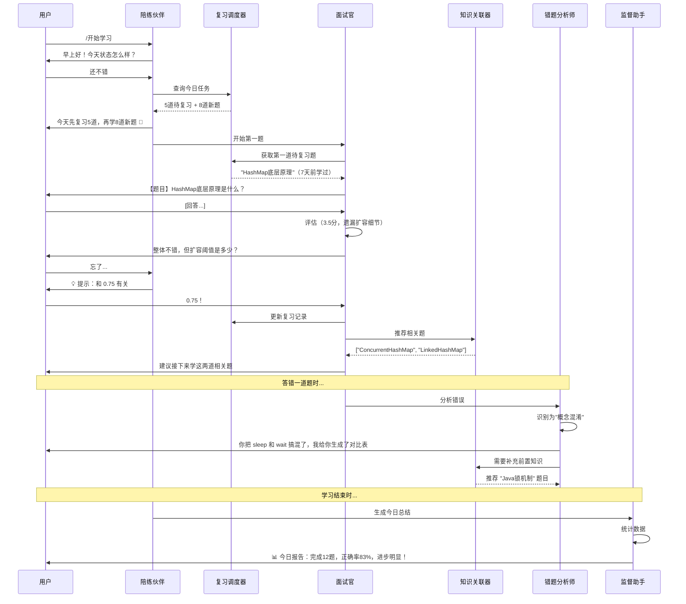

# 🤖 AI 面试陪练系统 - Agent 架构文档

> **项目**: AI 面试陪练 Agent Harness  
> **版本**: 1.0.0  
> **更新**: 2026-06-28

---

## AI 协作执行规则

本节是给 Claude、Codex、Cursor 等 AI 编码助手看的执行约束，优先级高于下面的架构说明。

### Git 提交规则

AI 执行 `git commit` 前必须先读取 `GIT_RULES.md`，并按下面规则提交：

- 提交信息必须使用中文描述，禁止纯英文 subject。
- 提交信息必须使用格式：`<type>(<scope>): <中文描述>`。
- `scope` 必须填写，使用小写英文、数字、短横线或下划线，例如 `agents`、`python-comments`、`git-rules`。
- 允许的 `type`：`feat`、`fix`、`docs`、`style`、`refactor`、`test`、`chore`、`perf`。
- 示例：`docs(git-rules): 强化提交规范执行`。
- 每次完成文件修改并验证后必须提交；同一任务内相关文件可以合并为一个提交。
- 除非用户明确说“不要提交”或“先别提交”，否则最终回复前不能留下未提交修改。
- `git add`、`git commit`、`git reset`、`git config` 等会写入 `.git` 的命令禁止并行执行，只能单进程顺序执行。
- 提交后必须执行 `git status --short` 和 `git log -1 --oneline`，确认工作区干净且提交信息符合规则。

仓库已提供 `.githooks/commit-msg` 校验提交信息。若本地未生效，执行：

```bash
git config core.hooksPath .githooks
```

### 学习型开发规则

项目维护者是 Python 初学者，有 Java 基础。AI 修改 Python 代码时，必须兼顾“功能实现”和“学习可读性”：

- 业务流程要写清楚：关键函数、数据流、数据库写入、Agent 调用链路都要让初学者能跟上。
- 对 Python 特有语法要适当补充注释，例如装饰器、上下文管理器、列表推导式、`async/await`、`Optional`、`dict.get()`、解包、`dataclass`。
- 优先用 Java 类比解释，例如“类似 Java 的 Map / POJO / try-with-resources / super(...)”。
- 注释解释“为什么这样做”和“这一步在流程里的作用”，不要写无意义注释，例如“把 a 赋值给 a”。
- 新增或修改复杂逻辑时，优先拆成小函数，并给函数写清楚 docstring，便于边开发边学习 Python、Agent Harness 和 AI 工程知识。

---

## 📊 系统概览

本系统基于 **Agent Harness** 架构设计，包含 **6 个协作 Agent**，为用户提供智能化的面试准备服务。

### 核心理念

- **多角色协作**：6 个 Agent 各司其职，相互配合
- **持久记忆**：三层记忆系统（短期、中期、长期）
- **自动进化**：基于学习数据持续优化
- **数据驱动**：精准识别薄弱环节

---

## 🎭 六大 Agent 角色

### 1. 面试官 Agent (Interviewer) 👔

**角色定位**: 严格但专业的技术面试官

**核心职责**:
- 智能选题（基于薄弱模块推荐）
- 四维度评估（准确性、完整性、深度、场景化）
- 追问引导（最多 2 次追问）
- 生成反馈报告

**System Prompt**: `agents/definitions/interviewer.md`

**实现文件**: `agents/roles/interviewer_agent.py`

**工具调用**:
```yaml
tools:
  - get_weak_modules: 获取薄弱模块
  - get_random_question: 从模块中抽题
  - evaluate_answer: 评估答案并打分
  - update_learning_record: 更新学习记录
  - calculate_next_review: 计算下次复习时间
```

**工作流程**:
```
1. 查询薄弱模块
2. 从模块中随机抽题
3. 等待用户回答
4. 评估答案（4个维度）
5. 决定是否追问
6. 生成反馈报告
7. 更新记忆系统
```

---

### 2. 复习调度器 Agent (Scheduler) ⏰

**角色定位**: 遗忘曲线管理专家

**核心职责**:
- 基于 SM-2 算法计算复习时间
- 生成每日复习清单
- 优先级排序（综合考虑：过期天数、掌握度、重要性）
- 动态调整复习间隔

**System Prompt**: `agents/definitions/scheduler.md`

**实现文件**: `agents/roles/scheduler_agent.py`

**当前实现状态**: 已具备基础业务能力，包括生成每日复习清单、根据本次表现更新下次复习时间，以及通过 `process()` 按 action 路由调用。

**核心算法**: SuperMemo SM-2
```python
def calculate_next_review(easiness, repetitions, interval, performance):
    """
    SM-2 算法
    
    Args:
        easiness: 难度因子（1.3-3.0）
        repetitions: 重复次数
        interval: 当前间隔（天）
        performance: 表现评分（0-5）
    
    Returns:
        next_interval: 下次复习间隔（天）
    """
    if performance < 3:
        # 答错了，重新开始
        return 1
    
    if repetitions == 0:
        return 1
    elif repetitions == 1:
        return 6
    else:
        return int(interval * easiness)
```

**工具调用**:
```yaml
tools:
  - get_due_reviews: 获取到期复习题目
  - calculate_review_priority: 计算优先级
  - update_review_schedule: 更新复习计划
  - push_daily_review_list: 推送复习清单
```

---

### 3. 知识关联器 Agent (Linker) 🔗

**角色定位**: 知识图谱构建师

**核心职责**:
- 基于 TF-IDF 计算题目相似度
- 构建知识关联图谱
- 推荐相关题目（学完一题推荐相关题）
- 识别知识盲区

**System Prompt**: `agents/definitions/linker.md`

**实现文件**: `agents/roles/linker_agent.py`

**关联类型**:
```yaml
relation_types:
  - compare: 对比型（如 HashMap vs ConcurrentHashMap）
  - progressive: 递进型（如 ArrayList -> 扩容机制 -> 并发问题）
  - scenario: 场景型（如 线程池 + 拒绝策略 + 参数调优）
  - prerequisite: 前置型（如 Java内存模型 是理解 volatile 的前置）
```

**工具调用**:
```yaml
tools:
  - extract_keywords: 提取题目关键词
  - calculate_similarity: 计算题目相似度
  - find_related_questions: 查找相关题目
  - build_knowledge_graph: 构建知识图谱
```

**技术方案**: TF-IDF + 余弦相似度
```python
from sklearn.feature_extraction.text import TfidfVectorizer
from sklearn.metrics.pairwise import cosine_similarity

def find_related_questions(question_id, top_k=5):
    """找出最相关的 k 道题"""
    # 1. TF-IDF 向量化
    vectorizer = TfidfVectorizer()
    tfidf_matrix = vectorizer.fit_transform(all_questions_text)
    
    # 2. 余弦相似度
    similarities = cosine_similarity(tfidf_matrix[question_idx], tfidf_matrix)
    
    # 3. Top-K
    top_indices = similarities.argsort()[0][-top_k:]
    return [questions[i] for i in top_indices]
```

---

### 4. 错题分析师 Agent (Analyzer) 🔍

**角色定位**: 错误模式识别专家

**核心职责**:
- 深度分析错误原因
- 识别重复犯错模式
- 生成"易混淆知识点对比表"
- 推荐补救题目

**System Prompt**: `agents/definitions/analyzer.md`

**实现文件**: `agents/roles/analyzer_agent.py`

**错误分类**:
```yaml
error_types:
  concept_confusion:
    description: 概念混淆
    example: "sleep 和 wait 功能搞混"
    solution: "生成对比表 + 记忆口诀"
  
  detail_missing:
    description: 细节遗漏
    example: "知道 HashMap 原理，但忘记扩容阈值"
    solution: "关键数字卡片"
  
  scenario_lack:
    description: 场景理解不足
    example: "会背概念，但不知道何时用"
    solution: "实战案例练习"
  
  prerequisite_gap:
    description: 前置知识缺失
    example: "不理解内存模型就学 volatile"
    solution: "推荐前置题目"
```

**工具调用**:
```yaml
tools:
  - analyze_wrong_answer: 分析错误答案
  - find_similar_mistakes: 查找相似错误
  - generate_comparison_table: 生成对比表
  - recommend_remedial_questions: 推荐补救题目
```

---

### 5. 监督助手 Agent (Supervisor) 📊

**角色定位**: 学习教练和数据分析师

**核心职责**:
- 生成学习报告（日报、周报）
- 分析学习趋势（进步曲线、停滞期）
- 识别学习瓶颈
- 制定阶段性学习目标

**System Prompt**: `agents/definitions/supervisor.md`

**实现文件**: `agents/roles/supervisor_agent.py`

**当前实现状态**: 已具备基础报告能力，包括生成日报、周报 Markdown，汇总学习统计、薄弱模块和到期复习题。

**报告类型**:
```yaml
reports:
  daily:
    title: "每日学习简报"
    content:
      - 今日完成题数
      - 平均得分
      - 掌握率变化
      - 明日建议
  
  weekly:
    title: "学习周报"
    content:
      - 本周进步分析
      - 薄弱模块识别
      - 学习效率评估
      - 下周计划
  
  sprint:
    title: "面试冲刺报告"
    content:
      - 距离面试天数
      - 剩余任务清单
      - 高频考点掌握情况
      - 重点复习建议
```

**工具调用**:
```yaml
tools:
  - query_learning_stats: 查询学习统计
  - generate_progress_chart: 生成进度图表
  - identify_bottleneck: 识别学习瓶颈
  - create_learning_plan: 制定学习计划
  - export_report: 导出报告到 Obsidian
```

---

### 6. 陪练伙伴 Agent (Buddy) 🤝

**角色定位**: 友好的学习伙伴

**核心职责**:
- 情绪支持和鼓励
- 答题卡壳时给提示（3级递进）
- 通俗语言解释复杂概念
- 学习疲劳时调节氛围

**System Prompt**: `agents/definitions/buddy.md`

**实现文件**: `agents/roles/buddy_agent.py`

**提示策略**:
```yaml
hint_levels:
  level_1:
    type: "方向性提示"
    example: "从 HashMap 的数据结构特点想起"
  
  level_2:
    type: "对比性提示"
    example: "想想它和 LinkedHashMap 的区别"
  
  level_3:
    type: "关键词提示"
    example: "关键词：数组、链表、红黑树、负载因子"
```

**鼓励策略**:
```yaml
encouragement:
  streak_achievement:
    trigger: "连续答对 3 题"
    message: "太棒了！你已经掌握了这个模块的节奏 💪"
  
  breakthrough:
    trigger: "突破难题"
    message: "这道题很多人都卡住，你居然答出来了！"
  
  persistence:
    trigger: "连续学习 7 天"
    message: "今天是你连续学习的第7天，习惯正在养成 🔥"
```

**工具调用**:
```yaml
tools:
  - give_hint: 给出提示（分级）
  - explain_in_simple_terms: 通俗解释
  - generate_encouragement: 生成鼓励
  - suggest_break: 建议休息
```

---

## 🔄 Agent 协作流程

### 典型学习场景（完整流程）



---

## 🗂️ Agent 配置文件

### 主配置文件

**文件**: `.harness/config/agents_config.yaml`

```yaml
agents:
  interviewer:
    enabled: true
    priority: 1
    model: "deepseek-chat"
    temperature: 0.7
    max_tokens: 2000
    
  scheduler:
    enabled: true
    priority: 2
    algorithm: "sm2"
    initial_interval: 1
    
  linker:
    enabled: true
    priority: 3
    similarity_threshold: 0.7
    top_k: 5
    
  analyzer:
    enabled: true
    priority: 3
    
  supervisor:
    enabled: true
    priority: 4
    
  buddy:
    enabled: true
    priority: 1
    temperature: 0.9
```

---

## 🛠️ Agent 通信机制

### 父子通信（请求-响应）

```python
# 面试官 Agent 调用 复习调度器 Agent
result = await scheduler.get_due_reviews(limit=5)
```

### 消息总线（对等通信）

```python
class MessageBus:
    """Agent 之间的消息总线"""
    
    def publish(self, from_agent, to_agent, message):
        """发布消息"""
        pass
    
    def subscribe(self, agent_id, handler):
        """订阅消息"""
        pass

# 使用示例
message_bus.publish(
    from_agent='interviewer',
    to_agent='analyzer',
    message={'type': 'wrong_answer', 'data': {...}}
)
```

---

## 📁 文件结构

```
agents/                              # 标准 Python Agents 包（正式实现）
├── core/                            # 通用执行引擎
│   ├── base_agent.py                # Agent 基类
│   ├── agent_loop.py                # TAOR 循环
│   ├── tool_registry.py             # 工具注册
│   └── context_manager.py           # 上下文管理
│
├── roles/                           # 具体 Agent 角色
│   ├── interviewer_agent.py         # 面试官
│   ├── scheduler_agent.py           # 复习调度器（基础能力已实现）
│   ├── linker_agent.py              # 知识关联器（规划）
│   ├── analyzer_agent.py            # 错题分析师（规划）
│   ├── supervisor_agent.py          # 监督助手（基础报告能力已实现）
│   └── buddy_agent.py               # 陪练伙伴（规划）
│
├── tools/                           # Agent 可调用工具
│   ├── question_tools.py            # 题库工具
│   └── memory_tools.py              # 记忆工具
│
└── definitions/                     # Agent 角色定义文档
    ├── interviewer.md
    ├── scheduler.md
    ├── linker.md
    ├── analyzer.md
    ├── supervisor.md
    └── buddy.md

.harness/                            # 配置、记忆和数据库
├── config/
│   ├── harness.yaml                 # 主配置
│   └── agents_config.yaml           # Agent 配置
├── memory/                          # 长期记忆文件
└── db/                              # 数据库 Schema / SQLite 文件
```

---

## 🎯 使用指南

### 启动面试模式

```python
from agents.roles.interviewer_agent import InterviewerAgent

interviewer = InterviewerAgent()
result = await interviewer.start_interview(mode='weak_module')
```

### 生成学习报告

```python
from agents.roles.supervisor_agent import SupervisorAgent

supervisor = SupervisorAgent()
report = supervisor.generate_weekly_report()
```

### 查询复习清单

```python
from agents.roles.scheduler_agent import SchedulerAgent

scheduler = SchedulerAgent()
review_list = scheduler.get_daily_review_list()
```

---

## 📚 参考资料

- **Agent Harness 开发手册**: `Agent-Harness-Develop-Book/README.md`
- **实施计划**: `PLAN.md`
- **对比分析**: `COMPARISON_REPORT_V2.md`
- **MySQL 配置**: `MYSQL_SETUP.md`

---

## 🔄 版本历史

- **v1.0.0** (2026-06-24) - 初始版本
  - 定义 6 个 Agent 角色
  - 设计协作流程
  - 规划实施路径

---

**维护者**: AI 面试陪练系统开发团队  
**更新日期**: 2026-06-28
