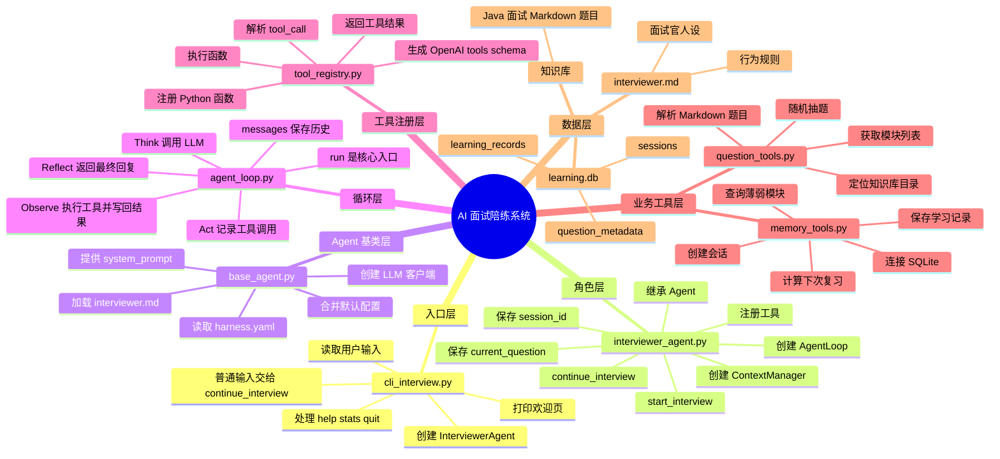

# AI 面试陪练系统学习地图

这份地图用于快速恢复记忆。先看主链路，再看分层职责，最后用回忆卡片自测。

如果你是第一次系统学习，建议先读 `SYSTEM_LEARNING_GUIDE.md`；如果只是忘了流程，用这份学习地图快速恢复记忆。

## 一句话总览

用户在命令行输入内容，`cli_interview.py` 把输入交给 `InterviewerAgent`，`InterviewerAgent` 再交给 `AgentLoop.run()`。`AgentLoop` 调用 LLM，LLM 如果要工具，就让 `ToolRegistry` 执行 `question_tools` 或 `memory_tools`，工具结果回到 LLM，最终生成面试官回复。

## 主链路

```text
用户输入
  -> scripts/cli_interview.py
  -> agents/roles/interviewer_agent.py
  -> agents/core/agent_loop.py
  -> LLM
  -> agents/core/tool_registry.py
  -> agents/tools/question_tools.py 或 agents/tools/memory_tools.py
  -> LLM 根据工具结果组织回复
  -> cli_interview.py 打印给用户
```

## 系统分层思维导图



## 文件职责表

| 文件 | 你要记住的作用 | 关键函数或变量 |
|---|---|---|
| `scripts/cli_interview.py` | 命令行外壳，负责输入输出 | `main()`、`input()`、`agent.start_interview()`、`agent.continue_interview()` |
| `agents/roles/interviewer_agent.py` | 组装面试官 Agent | `__init__()`、`_register_tools()`、`start_interview()`、`continue_interview()` |
| `agents/core/base_agent.py` | 所有 Agent 的底座 | `load_config()`、`load_system_prompt()`、`_init_llm_client()` |
| `agents/core/agent_loop.py` | 系统心脏，负责循环 | `run()`、`_call_llm()`、`_build_llm_messages()` |
| `agents/core/tool_registry.py` | 工具电话簿，负责注册和执行工具 | `register()`、`get_tool_schemas()`、`execute_tool()` |
| `agents/tools/question_tools.py` | 题库读取工具 | `get_random_question()`、`get_all_modules()`、`parse_question_file()` |
| `agents/tools/memory_tools.py` | 数据库记忆工具 | `create_session()`、`get_weak_modules()`、`add_learning_record()`、`calculate_next_review()` |
| `agents/definitions/interviewer.md` | 面试官人设和行为规则 | system prompt |
| `.harness/db/learning.db` | SQLite 学习数据库 | `sessions`、`learning_records`、`question_metadata` |
| `知识库/Java面试` | Markdown 面试题来源 | 模块目录和题目文件 |

## 两条最重要的运行路径

### 第一次启动面试

```text
cli_interview.py
  -> agent = InterviewerAgent()
    -> base_agent 加载配置和 prompt
    -> 注册 4 个工具
    -> 创建 AgentLoop
  -> await agent.start_interview()
    -> 创建 session_id
    -> memory_tools.create_session()
    -> agent_loop.run(默认开场消息)
    -> LLM 可能调用 get_weak_modules
    -> LLM 可能调用 get_question_from_module
    -> 返回第一道题
```

### 用户回答一道题

```text
用户输入答案
  -> cli_interview.py 读到 user_input
  -> await agent.continue_interview(user_input)
  -> agent_loop.run(user_input)
  -> LLM 根据 messages 判断这是答案
  -> LLM 可能调用 save_evaluation
  -> memory_tools.add_learning_record()
  -> memory_tools.calculate_next_review()
  -> LLM 组织反馈或追问
  -> cli_interview.py 打印回复
```

## 四个工具的用途

| 工具名 | 谁注册 | 实际调用谁 | 作用 |
|---|---|---|---|
| `get_weak_modules` | `InterviewerAgent._register_tools()` | `memory_tools.get_weak_modules()` | 查历史记录，找薄弱模块 |
| `get_question_from_module` | `InterviewerAgent._register_tools()` | `question_tools.get_random_question()` | 从模块抽题，并设置 `self.current_question` |
| `get_all_modules` | `InterviewerAgent._register_tools()` | `question_tools.get_all_modules()` | 查询题库有哪些模块 |
| `save_evaluation` | `InterviewerAgent._register_tools()` | `memory_tools.add_learning_record()` | 保存评分、薄弱点和复习计划 |

## 记忆口诀

```text
CLI 管输入输出
Agent 管角色和工具
Loop 管循环
Registry 管工具调用
Tools 管真实业务
DB 和知识库管数据
```

## 看代码时的定位问题

每次忘了当前位置，就问自己这 5 个问题：

1. 这段代码是在接收用户输入，还是在处理 Agent 逻辑？
2. 这段代码是在组装对象，还是在执行一次对话？
3. 这段代码是在调用 LLM，还是在执行工具？
4. 这段代码是在读题库文件，还是在写数据库？
5. 这段代码修改的是短期消息历史，还是长期学习记录？

## 回忆卡片

### 卡片 1

问题：`cli_interview.py` 的核心职责是什么？

答案：负责命令行输入输出，创建 `InterviewerAgent`，把普通用户输入交给 `continue_interview()`。

### 卡片 2

问题：`InterviewerAgent` 初始化时做了什么？

答案：父类加载配置和 prompt，创建 LLM 客户端，注册工具，创建上下文管理器，创建 `AgentLoop`，初始化 `current_question` 和 `session_id`。

### 卡片 3

问题：`AgentLoop.run()` 为什么要循环？

答案：因为 LLM 可能先调用工具，拿到工具结果后还要再思考，直到不再调用工具才返回最终回复。

### 卡片 4

问题：工具是谁真正执行的？

答案：LLM 只提出 `tool_call`，真正执行 Python 函数的是 `ToolRegistry.execute_tool()`。

### 卡片 5

问题：当前题目保存在哪里？

答案：`InterviewerAgent.current_question`。抽题工具 `get_question_from_module` 成功后会设置它。

### 卡片 6

问题：学习记录保存在哪里？

答案：SQLite 数据库 `.harness/db/learning.db`，主要表是 `learning_records` 和 `question_metadata`。
